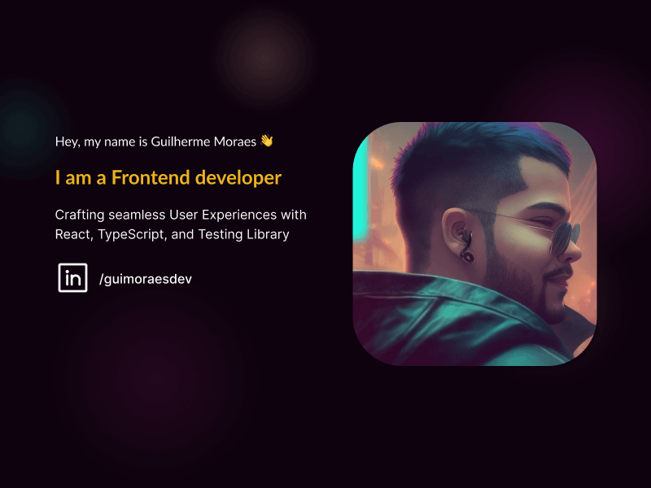

# My portfolio

[](https://nextjs.org/)
[](https://www.typescriptlang.org/)
[](https://tanstack.com/query/v5)
[](https://platform.openai.com/docs/overview)
[](https://react.email/)
[](https://zod.dev/)
[](https://tailwindcss.com/docs/installation)
[](https://react-hook-form.com/)
</br>
<small>Every badge are links to their doc</small>

<a href="https://www.linkedin.com/in/guimoraesdev/">
  
</a>

</br>

## Description of that project 📖

A SSR website to be my personal portfolio;

## Project Links

- 📝[Figma Project](https://www.figma.com/file/JCTgadu9Hf6FMQ26lBiUFN/Personal-Website?type=design&node-id=717%3A2&mode=design&t=4KCXdVFsUCtmVLOm-1)
- 📱[Production Link](www.guimoraes.dev/)

## Requirements 🛑

For development, you will need some software installed in your environment.

- [Node LTS](https://nodejs.org/en/download/)
- [PNPM](https://pnpm.io/installation)

## Running the project 🧰

Create a copy of the `.env.example` file, rename it to `.env.local` and add your own keys.

Use PNPM to install all dependencies into the project.

```sh
pnpm install
```

You can run the project with the following script.

```sh
pnpm dev
```

There are two dev scripts in the project, one for the next.js dev server, and another to the react-email dev server.

```sh
pnpm dev:app # Next.JS dev server
pnpm dev:email # React Email dev server
```

## Project Maintenance 👨‍🔧

- Project is using Angular Commits Guide Line, for more information, click on this [link](https://github.com/angular/angular/blob/master/CONTRIBUTING.md#-commit-message-format).
- Use [Atomic design](https://bradfrost.com/blog/post/atomic-web-design/) to organize and maintain this project.
- [Husky](https://typicode.github.io/husky/) will run commit hooks before every commit message to test the types and run the linting, do not bypass it.

## Tasks

- [ ] Add a limiter to the generation function, max 3 per day per session;
- [ ] Add test to form schema;
- [ ] Add test to check generation function limiter;
- [ ] Add rendering states tests;

## Doubts

Should show the preview in browsers which has no support?

- [ ] Yes, the UI must be equal and don't show different elements on diferente browsers
- [ ] No, The UI should not show an not usable block to the user polluting their screen
  - Why?
