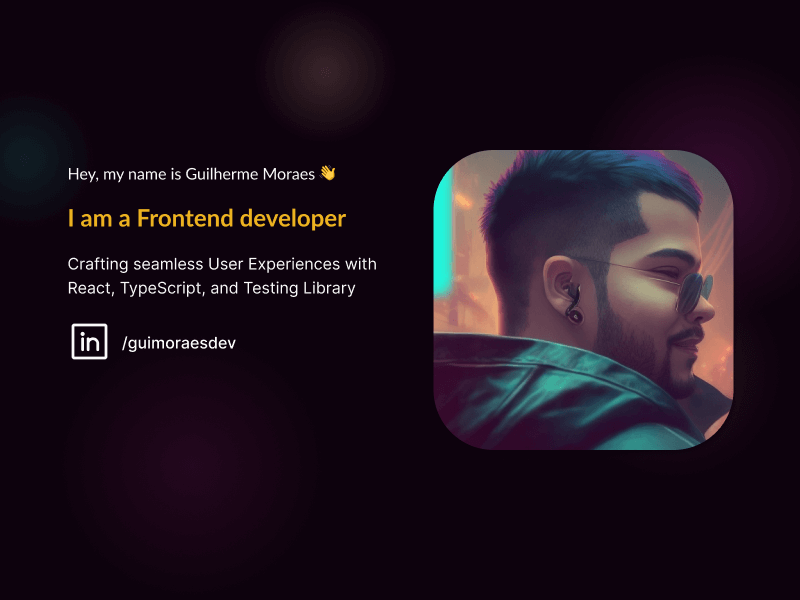

# My portfolio

[](https://nextjs.org/)
[](https://www.typescriptlang.org/)
[](https://tanstack.com/query/v5)
[](https://tailwindcss.com/docs/installation)
[](https://next-intl-docs.vercel.app/)
[](https://motion.dev/)
</br>
<small>Every badge is a link to its docs</small>

<a href="https://www.linkedin.com/in/guimoraesdev/">
  
</a>

</br>

## Description of that project 📖

A SSR website to be my personal portfolio.

## Project Links

- 📝[Figma Project](https://www.figma.com/file/JCTgadu9Hf6FMQ26lBiUFN/Personal-Website?type=design&node-id=717%3A2&mode=design&t=4KCXdVFsUCtmVLOm-1)
- 📱[Production Link](https://www.guimoraes.dev/)

## Requirements 🛑

For development, you will need Node LTS installed.

- [Node LTS](https://nodejs.org/en/download/)

## Running the project 🧰

Create a copy of the `.env.example` file, rename it to `.env.local` and add your own keys.

Install all dependencies:

```sh
npm install
```

Run the development server:

```sh
npm run dev
```

## Available Scripts

| Script | Description |
|---|---|
| `npm run dev` | Next.js dev server with Turbopack |
| `npm run build` | Production build |
| `npm run start` | Start production server |
| `npm run lint` | Run ESLint |
| `npm run lint:fix` | Run ESLint with auto-fix |
| `npm run check-types` | TypeScript type check |
| `npm run test:unit` | Run unit tests with Jest |
| `npm run test:e2e` | Run end-to-end tests with Playwright |
| `npm run test:e2e:ui` | Run Playwright tests with UI |

## Project Maintenance 👨‍🔧

- Project follows [Angular Commit Guidelines](https://github.com/angular/angular/blob/master/CONTRIBUTING.md#-commit-message-format).
- Uses [Atomic Design](https://bradfrost.com/blog/post/atomic-web-design/) to organize components.
- [Husky](https://typicode.github.io/husky/) runs commit hooks before every commit to check types and linting — do not bypass it.
